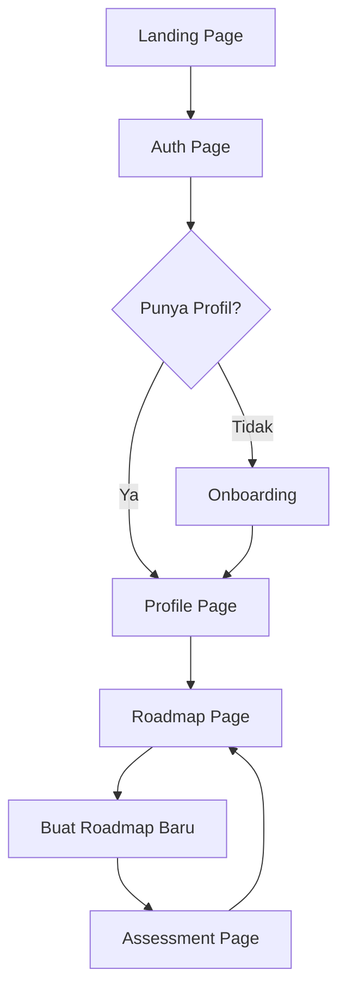

<div align="center">

# 🚀 NusaSkill AI

### AI-Powered Personalized Learning Roadmap Platform

*Bangun jalur pembelajaran karir yang dipersonalisasi dengan kecerdasan buatan berbasis standar SKKNI Indonesia.*

[](https://react.dev)
[](https://www.typescriptlang.org)
[](https://vite.dev)
[](https://tailwindcss.com)

</div>

---

## 📖 Deskripsi / Description

**NusaSkill AI** is a web-based platform that leverages artificial intelligence to generate personalized learning roadmaps for Indonesian professionals. The platform creates customized study paths based on national competency standards (SKKNI), user skill assessments, and career goals.

**NusaSkill AI** adalah platform berbasis web yang memanfaatkan kecerdasan buatan untuk menghasilkan roadmap pembelajaran yang dipersonalisasi untuk para profesional Indonesia. Platform ini membuat jalur studi yang disesuaikan berdasarkan Standar Kompetensi Kerja Nasional Indonesia (SKKNI), asesmen kemampuan pengguna, dan target karir.

---

## ✨ Fitur / Features

| Feature | Description |
|---|---|
| 🌳 **Rooted Tree Visualization** | Interactive tree roadmap with zoom, pan, and touch support |
| 🤖 **AI-Generated Assessments** | Pre-test questions tailored to your career target |
| 🎨 **Light & Dark Themes** | Seamless theme switching with persistent state |
| 📱 **Full Responsiveness** | Mobile-first design with hamburger menu & touch gestures |
| 🔐 **Auth System** | Email/password + Google SSO authentication |
| ✏️ **Profile Management** | Edit profile with name, location, and education |
| 🗺️ **Multiple Roadmaps** | Create new roadmaps with different career targets |
| 💎 **Glassmorphism UI** | Premium glass cards, micro-animations, and gradient effects |

---

## 🛠️ Tech Stack

| Category | Technology |
|---|---|
| **Framework** | [React 19](https://react.dev) + [TypeScript 6](https://www.typescriptlang.org) |
| **Build Tool** | [Vite 8](https://vite.dev) |
| **Styling** | [Tailwind CSS 4](https://tailwindcss.com) + CSS Variables |
| **State Management** | [Zustand 5](https://zustand.docs.pmnd.rs/) (persisted) |
| **Form Handling** | [React Hook Form 7](https://react-hook-form.com) + [Zod 4](https://zod.dev) |
| **HTTP Client** | [Axios](https://axios-http.com) |
| **Routing** | [React Router 7](https://reactrouter.com) |
| **Icons** | [Lucide React](https://lucide.dev) |
| **Notifications** | [React Hot Toast](https://react-hot-toast.com) |

---

## 🚀 Getting Started

### Prerequisites / Prasyarat

- **Node.js** ≥ 18.x
- **npm** ≥ 9.x (or **yarn** / **pnpm**)

### Installation / Instalasi

```bash
# 1. Clone the repository / Kloning repositori
git clone https://github.com/your-team/nusa-skill-web.git
cd nusa-skill-web

# 2. Install dependencies / Instal dependensi
npm install

# 3. Set up environment / Atur lingkungan
cp .env.example .env
# Edit .env and set VITE_API_BASE_URL to your backend API URL
# Edit .env dan atur VITE_API_BASE_URL ke URL API backend Anda

# 4. Run the development server / Jalankan server pengembangan
npm run dev
```

The application will be available at `http://localhost:5173`.

### Environment Variables / Variabel Lingkungan

| Variable | Description | Example |
|---|---|---|
| `VITE_API_BASE_URL` | Backend API base URL | `http://localhost:3000/api` |

### Build for Production / Build untuk Produksi

```bash
npm run build
npm run preview
```

---

## 📁 Folder Structure / Struktur Folder

```
nusa-skill-web/
├── public/                        # Static assets / Aset statis
├── src/
│   ├── components/
│   │   ├── layout/
│   │   │   ├── DashboardLayout.tsx   # Shared sidebar layout / Tata letak sidebar bersama
│   │   │   └── Navbar.tsx            # Public page navbar / Navbar halaman publik
│   │   ├── roadmap/
│   │   │   └── RoadmapTree.tsx       # Interactive tree visualization / Visualisasi pohon interaktif
│   │   ├── ui/
│   │   │   ├── CustomDropdown.tsx    # Animated dropdown / Dropdown animasi
│   │   │   ├── SkeletonLoader.tsx    # Loading skeletons / Skeleton loading
│   │   │   └── ThemeToggle.tsx       # Sun/Moon theme switch / Tombol tema
│   │   └── ErrorBoundary.tsx         # Error fallback UI / UI fallback error
│   ├── features/
│   │   └── auth/
│   │       ├── AuthPage.tsx          # Auth layout / Halaman autentikasi
│   │       ├── LoginForm.tsx         # Login form / Form masuk
│   │       └── RegisterForm.tsx      # Register form / Form daftar
│   ├── lib/
│   │   └── api.ts                    # Axios config + interceptors / Konfigurasi Axios
│   ├── pages/
│   │   ├── AssessmentPage.tsx        # AI assessment / Asesmen AI
│   │   ├── LandingPage.tsx           # Hero landing page / Halaman utama hero
│   │   ├── OnboardingPage.tsx        # User onboarding / Onboarding pengguna
│   │   ├── ProfilePage.tsx           # User profile & settings / Profil & pengaturan
│   │   └── RoadmapPage.tsx           # Roadmap viewer & creation / Lihat & buat roadmap
│   ├── store/
│   │   ├── authStore.ts              # Auth state (Zustand) / State autentikasi
│   │   └── themeStore.ts             # Theme state (Zustand) / State tema
│   ├── types/                        # Shared TypeScript types / Tipe TypeScript bersama
│   ├── App.tsx                       # Root router & guards / Router utama & guard
│   ├── main.tsx                      # Entry point / Titik masuk
│   └── index.css                     # Design system (CSS variables) / Sistem desain
├── index.html                        # HTML template
├── package.json
├── tsconfig.json
├── vite.config.ts
└── README.md
```

---

## 🔄 User Flow / Alur Pengguna



1. **Landing** → User sees hero page with CTA
2. **Auth** → Login or Register (Email/Google)
3. **Onboarding** → Collects: Name, Location, Education
4. **Profile** → View/edit user info
5. **Roadmap** → View existing roadmaps or create new
6. **New Roadmap** → Collects: Career Target, Skill Level, Study Time
7. **Assessment** → AI-generated pre-test questions
8. **Roadmap Generated** → Interactive rooted tree visualization

---

## 🎨 Design System

The app uses a comprehensive CSS variable-based design system supporting both light and dark themes:

- **40+ design tokens** for colors, gradients, shadows, borders, and spacing
- **Glassmorphism** components with backdrop blur and semi-transparent backgrounds
- **15+ keyframe animations** including orbit, breathe, node-appear, grow-branch
- **Poppins** typography (300-900 weights)
- **Mobile-first** responsive breakpoints (`sm:`, `md:`, `lg:`)

---

## 👥 Team

**git push .env** — NusaSkill AI Development Team

---

## 📄 License

This project was built for the purposes of a competition entry. All rights reserved.